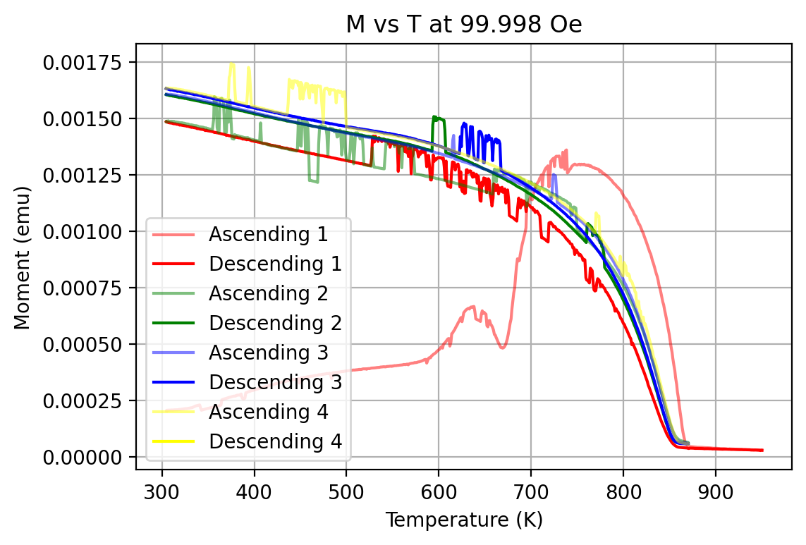
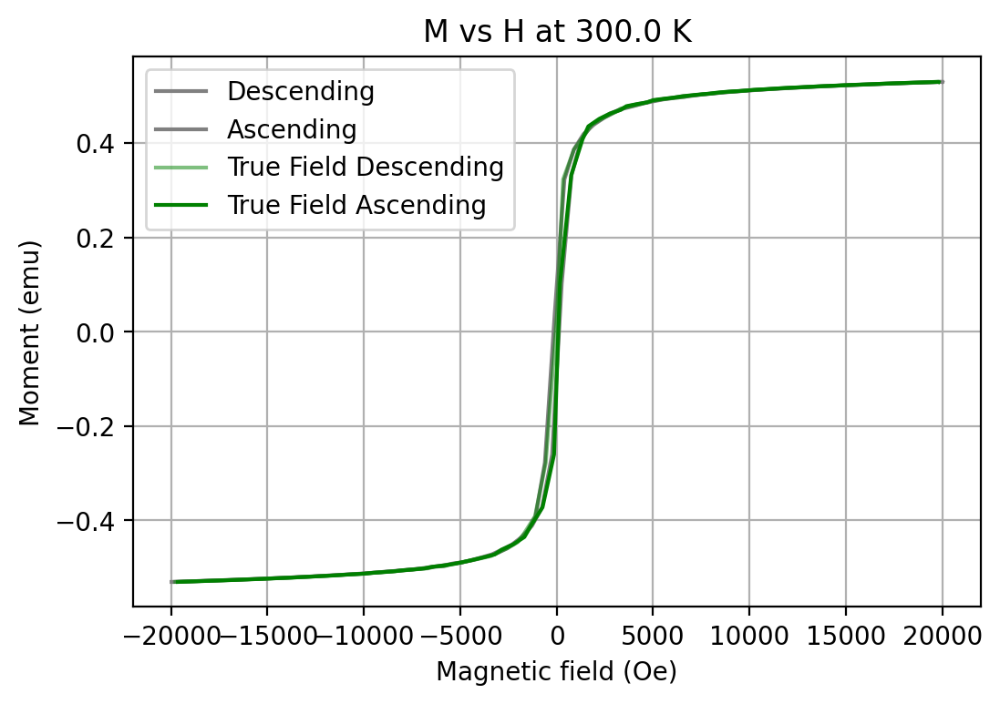

# PPMS system VSM datafile analysis
## Why?
The intention of this Python program is to perform the initial analysis on [VSM](https://www.youtube.com/watch?v=SiuO3_hgyO4&t=298s) "Quantum Design File Types" (with .md extension) files from the [Physical Property Measurement System](https://qd-europe.com/se/en/product/physical-property-measurement-system-ppms/).

## Setup

The functions used in the project are separated into different modules:
```
.
└── project/
    ├── main.py
    ├── modules/
    │   ├── read_in.py
    │   ├── prep.py
    │   ├── plot.py
    │   └── save.py
    └── ...
```
and are used in the `main.py` file as a linear program to perform the following blocks of tasks:
1. Read in the raw data
2. Prepare the data for ploting and saving (for further analysis in Origin for example)
3. Plot the measurement data into _**Moment vs Temperature**_/_**Moment vs Magnetic Field Strength**_ plots with an additional **_timeseries plot_** of the measurement



4. Saves parameters from each individual measurement into a `.csv` file 
